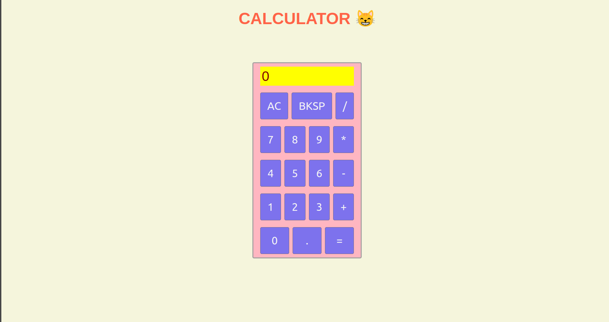

# Calculator - The Odin Project

This is a fully functional calculator built from scratch using HTML, CSS, and vanilla JavaScript. This project demonstrates core JavaScript concepts, including DOM manipulation, event handling, state management, and handling complex logic for calculator operations.

***

## Screenshot

## Live Demo

You can access it here: https://laym00n.github.io/odin-calculator/

## Features

* Performs all basic math operations: addition, subtraction, multiplication, and division.

* Handles chained operations (e.g., 12 + 7 - 5 =).

* Supports decimal point (.) calculations.

* Includes a "Clear" (AC) button to reset all calculations.

* Includes a "Backspace" (BKSP) button to correct the current input.

* Handles edge cases like dividing by zero, which displays Infinity.

* Correctly starts a new calculation when a digit is pressed after a result is shown.

* Full keyboard support for all digits, operators, equals (=), clear (Escape), and backspace.

## Technologies Used

1. HTML5: Structured the content and buttons.

2. CSS3: Styled the calculator using Flexbox for a responsive layout.

3. JavaScript (ES6+): Implemented all the calculator logic, state management, and event handling.

